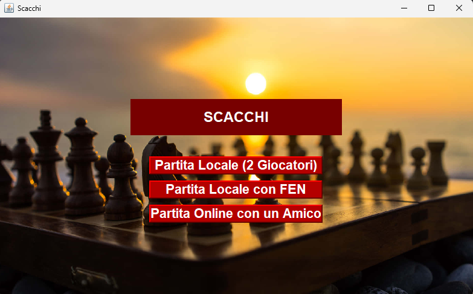
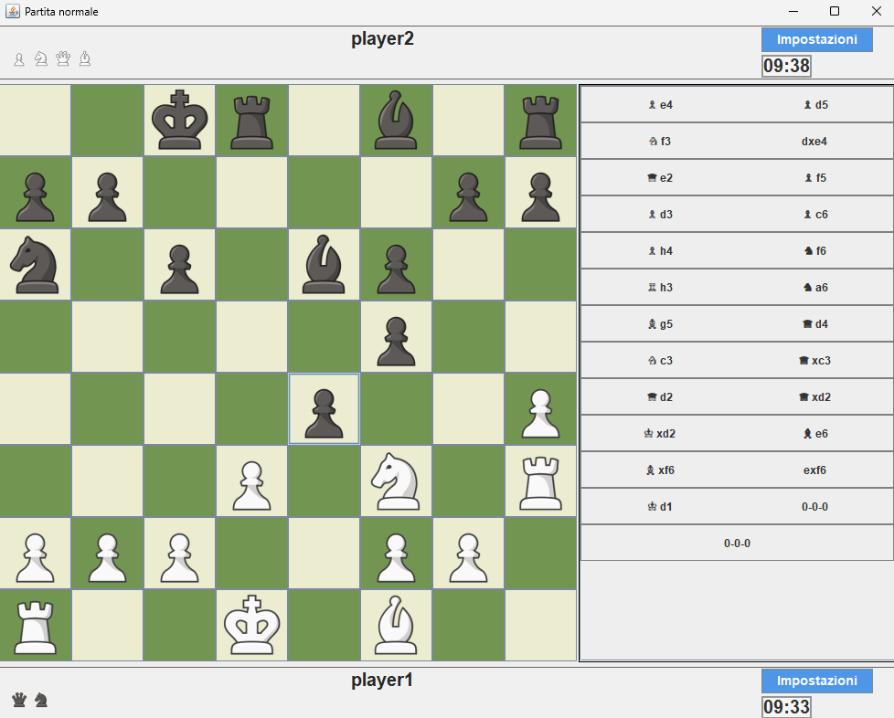

# Java Chess Game

Java Chess Game è un'applicazione desktop sviluppata in Java con Swing che implementa il gioco degli scacchi con modalità di gioco **offline**, **online tramite server e client**, e **configurazioni personalizzate tramite FEN**. Il gioco salva automaticamente le partite in file CSV, supporta timer per entrambi i giocatori e fornisce un'interfaccia semplice e funzionale.

## Screenshot

### Menu principale
Permette di scegliere tra le modalità di gioco disponibili.

### Interfaccia di gioco
Visualizza la scacchiera, i timer e la cronologia delle mosse.

## Modalità di gioco supportate

- **Classica**: Avvio con configurazione standard.
- **FEN Personalizzata**: Inizio da posizioni definite manualmente.
- **Multiplayer online**: Due giocatori in rete.

## Caratteristiche principali

- **Gioco offline**: Gioca in locale tra due utenti sulla stessa macchina.
- **Gioco online**: Modalità multiplayer tramite server e client in rete.
- **Salvataggio CSV**: Ogni mossa viene salvata in tempo reale in formato CSV.
- **Supporto FEN**: Inizia una partita da una posizione predefinita tramite notazione FEN.
- **Timer configurabile**: Ogni giocatore ha un tempo limite, mostrato a schermo.

## Come avviare il gioco

### Requisiti

- Java 8 o superiore
- IDE Java (consigliato: IntelliJ IDEA, Eclipse)

### Modalità Offline

1. Avvia il gioco e seleziona "Partita offline".
2. Inserisci i nomi dei giocatori e avvia la partita.
3. Le mosse vengono registrate nel file `.csv` in tempo reale.

### Modalità Online

1. Avvia il server su un dispositivo.
2. Avvia i client su due macchine.
3. Specifica IP e porta per stabilire la connessione.
4. Le mosse si sincronizzano tra i due dispositivi e vengono salvate.

### Modalità FEN

1. Seleziona "Partita con FEN".
2. Inserisci la notazione FEN per avviare da una configurazione personalizzata.

## Struttura dei salvataggi

Le partite vengono salvate in:

- `src/resources/matches/offline/`: CSV delle partite locali.
- `src/resources/matches/online/match-x/`: Partite online in sottocartelle numerate.

Esempio:
src/resources/matches/offline/player1-player2.csv
src/resources/matches/online/match-1/player1-0.csv

## Timer

Ogni giocatore ha un timer individuale. Quando uno dei due termina il tempo disponibile, l’altro viene dichiarato vincitore. Il tempo è configurabile.

## Istruzioni utente

1. Avvia il gioco e scegli la modalità.
2. Inserisci le informazioni richieste (nomi, FEN, IP/porta se online).
3. Inizia a giocare.
4. Le mosse vengono salvate automaticamente in un file `.csv`.

## Contribuire

Contribuzioni e miglioramenti sono i benvenuti! Apri una pull request per aggiunte, bugfix o nuove funzionalità. Si raccomanda di testare ogni modifica prima dell’invio.

## Licenza

Distribuito con licenza **MIT**. Vedi il file [LICENSE](LICENSE) per maggiori informazioni.

## Contatti

- **Autore**: Simone Siega  
- **Email**: [simonesiega1@gmail.com](mailto:simonesiega1@gmail.com)  
- **GitHub**: [simonesiega](https://github.com/simonesiega)

